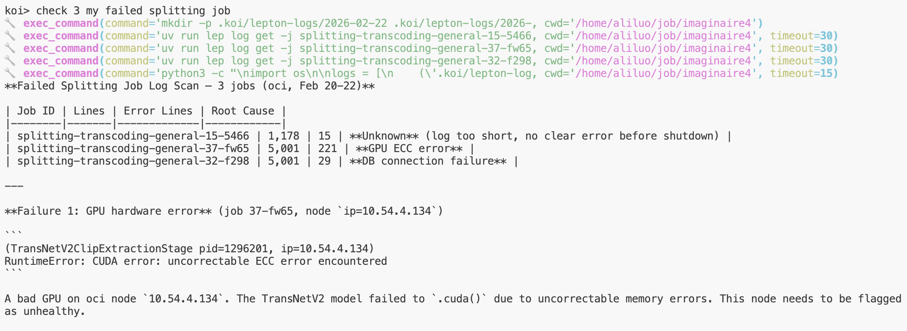
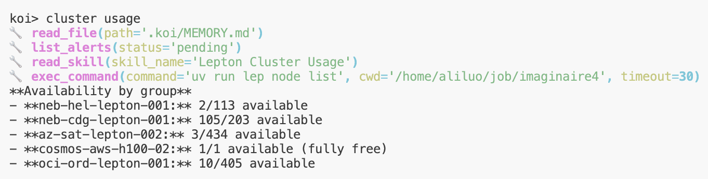
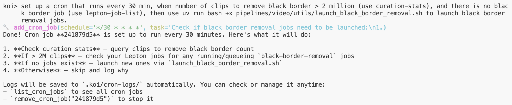
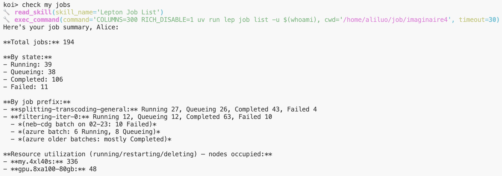
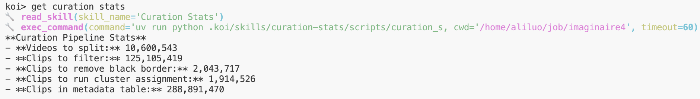

# Quick Start

## 1. Get an API Key

Get an API key from your LLM provider:
- [Anthropic](https://console.anthropic.com/) (Claude)
- [OpenAI](https://platform.openai.com/api-keys) (GPT, O3)
- [NVIDIA NIM](https://inference.nvidia.com/key-management)

## 2. Install

```bash
cd ~/koi
pip install -e .
```

## 3. Initialize a Project

```bash
cd your-project
koi init
```

Follow the prompts to configure your API key and model.

## 4. Start Chatting

```bash
koi run
```

Options:
```bash
koi run --thinking high              # Enable extended thinking
koi run --task "..." --non-interactive  # One-shot mode (for scripts/cron)
```

---

## Adding Skills

Skills extend Koi with domain-specific knowledge and workflows. The easiest way to create one:

1. Run the command you want Koi to learn, and make sure it works.
2. Ask Koi to package it: *"Use skill-creator to turn this into a skill."*

> **Rule of thumb:** Always use `skill-creator` instead of writing skill files by hand.

Skills live in `.koi/skills/<name>/SKILL.md` and are discovered automatically.

---

## Example Workflows

Here are some things Koi is good at:

### Batch-Analyze Failed Jobs

Manually checking logs across many failed jobs is tedious. Ask Koi to scan your last N failed jobs and summarize common failure causes with suggested fixes.



### Automated Cluster Monitoring

Set up cron jobs to watch cluster utilization and auto-submit new jobs when resources are available — even while you're away.



### Cron Jobs with Complex Logic

Schedule tasks with complicated conditions. For example: run black border removal when there are more than 2M clips to process and no existing job is running — check every 30 minutes.



<details>
<summary>Example cron execution log</summary>

```text
============================================================
[2026-02-24 12:00:01] Cron task started: Check if black border removal jobs
need to be launched...
============================================================

## Summary

**Black border removal jobs launched successfully.**

| Step | Check | Result |
|------|-------|--------|
| 1. Curation stats | `clips_to_remove_black_border` | **2,043,717** (> 2M ✅) |
| 2. Threshold check | Proceed? | **YES** |
| 3. Existing jobs | Running/Queueing? | **NONE** |
| 4. Launch | `launch_black_border_removal.sh` | **4 jobs created ✅** |

Total: **32 worker nodes** queued across 4 jobs.
```

</details>

### Check Jobs & Stats




---

## Tips

- **Use `/compact`** when context gets long — it summarizes older messages to free up space.
- **Use `/fork`** to branch a conversation — explore a different approach without losing your current thread.
- **Memory persists** — Koi remembers things across sessions via `.koi/MEMORY.md`. Use `/remember` to save notes.
- **Sandbox protects you** — File access and commands are sandboxed by default. Edit `.koi/sandbox.yaml` to adjust.

For full documentation, see the [Wiki](docs/wiki/index.md).
