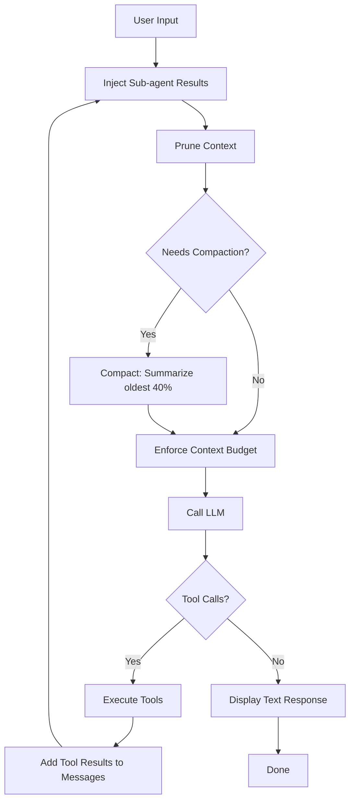

# Architecture Overview

## Layers

Koi has 4 main layers:

```
┌─────────────────────────────────────────────┐
│  CLI Layer (cli.py)                         │
│  Click commands, --debug, --model, --think  │
├─────────────────────────────────────────────┤
│  Agent Layer (agent.py)                     │
│  Conversation loop, streaming display,      │
│  command handling, signal/interrupt mgmt     │
├─────────────────────────────────────────────┤
│  Service Layer                              │
│  ToolExecutor │ Skills │ SubagentManager    │
│  Compactor │ Sandbox │ TranscriptLogger     │
├─────────────────────────────────────────────┤
│  LLM Layer (llm.py)                         │
│  3 API formats, thinking, caching, stream   │
│  → Anthropic, Chat Completions, Responses   │
└─────────────────────────────────────────────┘
```

## The Agent Loop

The core of Koi is `Agent._agent_loop()` in `agent.py`. It runs a while-loop that:

1. **Injects pending sub-agent results** into the message array
2. **Prunes context** — trims old tool results (`context_pruning.py`)
3. **Checks for compaction** — if messages exceed 60% of context window, summarize oldest 40% (`compaction.py`)
4. **Enforces context budget** — hard guard before LLM call (`context_guard.py`)
5. **Calls the LLM** — streaming in interactive mode, blocking in non-interactive
6. **Processes the response:**
   - If tool calls → execute tools, add results, **continue the loop**
   - If text → display and **break**



## Message Format

Koi uses the OpenAI message format internally (even for Anthropic — translation happens in LLMClient):

```python
# User message
{"role": "user", "content": "read the config file"}

# Assistant message with tool call
{"role": "assistant", "content": None, "tool_calls": [
    {"id": "call_123", "type": "function",
     "function": {"name": "read_file", "arguments": '{"path": ".koi/config.json"}'}}
]}

# Tool result
{"role": "tool", "tool_call_id": "call_123", "content": '{"content": "..."}'}

# System message (compaction summary)
{"role": "system", "content": "[Previous conversation summary: ...]"}
```

**Key design decision:** The system prompt is stored separately in `self.system_prompt`, never in the messages array. It's injected into the API payload at call time by LLMClient.

## Execution Modes

The Agent supports 3 execution modes:

| Mode | Method | Use Case |
|------|--------|----------|
| Interactive | `run_interactive()` | Terminal REPL with streaming, prompt_toolkit |
| Task | `run_task(task)` | One-shot execution (cron, CLI `--task`) |
| Pipe | `run_pipe_mode()` | JSON-over-stdin/stdout for sub-agent sessions |

## Signal Handling (Ctrl+C)

Koi uses flag-based cancellation (not `raise KeyboardInterrupt`):

1. `SIGINT` sets `_interrupted = True` and calls `task.cancel()`
2. `LLMClient.abort_stream()` closes the active httpx stream immediately
3. The agent loop catches `CancelledError` and rolls back partial messages
4. Only messages from the interrupted iteration are rolled back; completed iterations are preserved

When no agent task is running (at the prompt), `KeyboardInterrupt` is raised normally for prompt_toolkit to handle.

## Related Pages

- [LLM Client](llm-client.md) — How the LLM layer works
- [Tool System](tools.md) — How tools are defined and executed
- [Context Management](context-management.md) — The 4-layer context system
- [Streaming](streaming.md) — Token streaming and display
