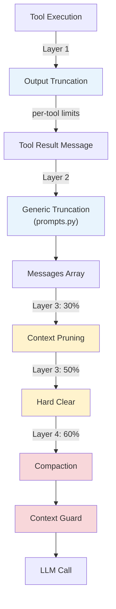
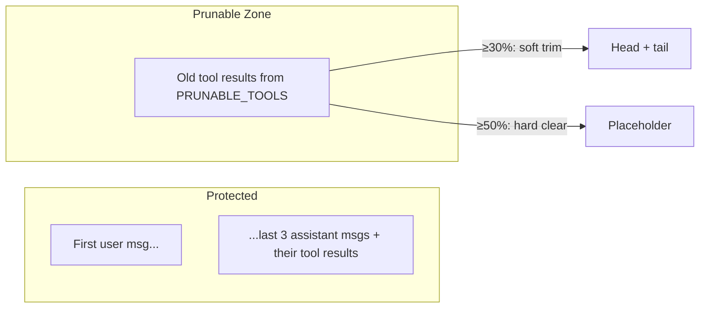

# Context Management

Koi uses a 4-layer system to keep the conversation within the LLM's context window. Each layer operates at a different granularity, from per-tool output limits to full conversation summarization.

## The 4 Layers at a Glance



| Layer | File | Trigger | Action |
|-------|------|---------|--------|
| 1. Output Truncation | `tools.py` | Per tool call | Cap output at tool-specific limits (50KB, 2K lines, etc.) |
| 2. Generic Truncation | `prompts.py` | Per tool result | Cap at `min(context_window * 1.2, 400K)` chars |
| 3. Context Pruning | `context_pruning.py` | 30% / 50% of window | Trim/clear old tool results |
| 4. Compaction + Guard | `compaction.py` / `context_guard.py` | 60% / 75% of window | LLM summarization, hard budget enforcement |

## Layer 1: Output Truncation (tools.py)

Per-tool limits applied at execution time. These prevent a single tool call from flooding the context:

```python
MAX_READ_LINES = 2000           # read_file
MAX_READ_BYTES = 50_000         # read_file (50KB)
MAX_EXEC_OUTPUT_BYTES = 50_000  # exec_command (50KB combined)
MAX_WEB_FETCH_CHARS = 20_000    # web_fetch (20K chars)
```

Additionally, `glob_files` caps at 500 matches and `grep_files` at 200 matches.

See [Tool System](tools.md) for details.

## Layer 2: Generic Truncation (prompts.py)

After tool execution, `build_tool_result_message()` passes the result through `truncate_tool_result()`:

```python
def truncate_tool_result(text: str, context_window: int) -> str:
    max_chars = max(2000, min(int(context_window * 0.3 * 4), 400_000))
    if len(text) <= max_chars:
        return text
    # Truncate at newline boundary within last 30% of budget
    ...
```

This is a safety net for tools whose output slips through Layer 1 limits or for unusually large context windows.

## Layer 3: Context Pruning (context_pruning.py)

Runs at the top of every agent loop iteration, **before** the LLM call. Two phases:

### Phase 1: Soft Trim (30% threshold)

When total context chars exceed **30%** of the context window (`SOFT_TRIM_RATIO = 0.3`):

- Scans old tool results (from `PRUNABLE_TOOLS`)
- Results larger than 4000 chars get head+tail trimmed:
  - Keep first 1500 chars
  - Keep last 1500 chars
  - Replace middle with `...`
  - Append: `[Tool result trimmed: kept first 1500 chars and last 1500 chars of N chars.]`

```python
PRUNABLE_TOOLS = {
    "read_file", "exec_command", "web_fetch",
    "web_search", "glob_files", "grep_files",
}
```

### Phase 2: Hard Clear (50% threshold)

When context still exceeds **50%** after soft trimming (`HARD_CLEAR_RATIO = 0.5`):

- Replace entire old prunable tool results with:
  ```
  [compacted: tool output removed to free context]
  ```
- Stops clearing once context drops below 50%
- Requires at least 50K chars of prunable content (`MIN_PRUNABLE_CHARS`)

### Protection Rules

Both phases respect:
- **Never prune before the first user message**
- **Never prune the last 3 assistant messages** or anything after them (`KEEP_LAST_ASSISTANTS = 3`)
- **Only prune tool results from `PRUNABLE_TOOLS`** (not memory, skills, alerts, etc.)



## Layer 4: Compaction + Context Guard

### Compaction (compaction.py)

Checked after pruning, triggers when messages exceed **60%** of the context window:

```python
def needs_compaction(self, messages):
    estimated_tokens = self.estimate_tokens(messages)
    return estimated_tokens > self.context_window * 0.6
```

When triggered:
1. **Split** messages at the 40% mark (oldest 40% vs. newest 60%)
2. **Adjust split point** to avoid breaking tool call/result pairs (`_safe_split_index`)
3. **Summarize** the oldest 40% via an LLM call (with a 120-second timeout)
4. **Replace** the oldest messages with a single system message:
   ```
   [Previous conversation summary: ...]
   ```

Token estimation uses `tiktoken` with the `cl100k_base` encoding.

If the LLM summarization times out, a fallback message is used:
```
[Compaction timed out — older context may be incomplete]
```

If compaction fails entirely (exception), Koi falls back to simple truncation — keeping the newest 60%.

### Context Guard (context_guard.py)

The **last line of defense** before every LLM call. Two-step enforcement:

**Step 1: Cap individual tool results**

No single tool result may exceed **50%** of the context window:
```python
SINGLE_TOOL_RESULT_SHARE = 0.5
max_single_tool_chars = context_window * TOOL_RESULT_CHARS_PER_TOKEN * 0.5
```

Oversized results are truncated at a newline boundary with:
```
[truncated: output exceeded context limit]
```

**Step 2: Total budget enforcement**

If total context exceeds **75%** of the window (`CONTEXT_INPUT_HEADROOM = 0.75`):
- Compact oldest tool results by replacing them with `[compacted: tool output removed to free context]`
- Works front-to-back until enough chars are freed

Tool output is weighted more heavily because it's denser (fewer chars per token):
```python
CHARS_PER_TOKEN = 4                 # Prose
TOOL_RESULT_CHARS_PER_TOKEN = 2     # Tool output (denser)
```

## When Each Layer Kicks In

```mermaid
gantt
    title Context Window Usage (% of window)
    dateFormat X
    axisFormat %s%%

    section Layers
    Layer 1-2: Per-tool limits    :done, 0, 100
    Layer 3: Soft trim (pruning)  :active, 30, 100
    Layer 3: Hard clear (pruning) :crit, 50, 100
    Layer 4: Compaction (LLM)     :crit, 60, 100
    Layer 4: Context guard        :crit, 75, 100
```



| % of Window | What Happens |
|-------------|--------------|
| 0–30% | Nothing — Layers 1 and 2 already limit individual outputs |
| 30–50% | Layer 3 soft trims: head+tail of old tool results |
| 50–60% | Layer 3 hard clears: replaces old tool results with placeholder |
| 60–75% | Layer 4 compaction: LLM summarizes oldest 40% of messages |
| 75%+ | Layer 4 guard: forcibly compacts oldest tool results |

## Execution Order in the Agent Loop

Every iteration of `_agent_loop()` runs these in order:

```python
# 1. Inject pending sub-agent results
# 2. Context pruning (Layer 3)
self.messages = prune_context(self.messages, self.config.context_window)

# 3. Compaction check (Layer 4a)
if self.compactor.needs_compaction(self.messages):
    self.messages = await self.compactor.compact_messages(self.messages)

# 4. Context guard (Layer 4b)
self.messages = enforce_context_budget(self.messages, self.config.context_window)

# 5. LLM call
```

All functions return **new lists** — they do not mutate the original messages array.

## Related Pages

- [Tool System](tools.md) — Per-tool output limits (Layer 1)
- [Architecture Overview](architecture.md) — The agent loop
- [LLM Client](llm-client.md) — Context window configuration
