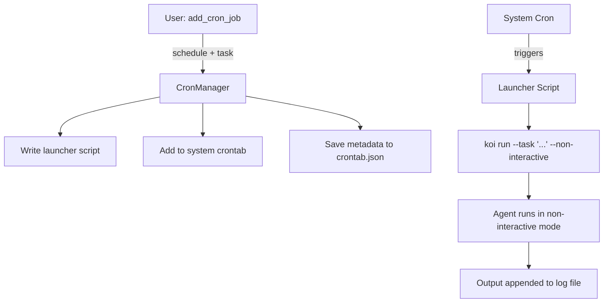

# Cron Integration

Koi can schedule tasks via the system crontab. Cron jobs are natural-language tasks that Koi interprets and executes each time they run.

## How It Works



## `CronManager`

The `CronManager` class (`cron.py:14`) manages the lifecycle of cron jobs. It operates on:

- **`.koi/crontab.json`** — Local metadata store (job ID, schedule, task, timestamps)
- **`.koi/cron-scripts/`** — Generated launcher scripts
- **`.koi/cron-logs/`** — Output log files
- **System crontab** — Actual scheduling via `crontab -l` / `crontab -`

### Adding a Job

`add_job(schedule, task)` (`cron.py:30`):

1. **Generate a job ID** — 8-char UUID
2. **Find the `koi` binary** — `shutil.which("koi")`
3. **Write a launcher script** — `.koi/cron-scripts/<job_id>.sh`:
   ```bash
   #!/usr/bin/env bash
   export PATH=/usr/bin:/usr/local/bin:...
   cd /path/to/project
   koi run --task "$(cat /path/to/.koi/cron-scripts/<job_id>.task)" \
       --non-interactive >> /path/to/.koi/cron-logs/<date>_<task>.log 2>&1
   ```
4. **Write the task text** — `.koi/cron-scripts/<job_id>.task` (avoids shell quoting issues)
5. **Add to system crontab**:
   ```
   0 * * * * /path/to/.koi/cron-scripts/<job_id>.sh # koi-<job_id>
   ```
6. **Save metadata** to `.koi/crontab.json`

Key design decisions:
- **Launcher script** avoids crontab line length limits
- **Separate task file** avoids all quoting issues with complex natural-language tasks
- **PATH export** captures the current `PATH` at job creation time so cron has access to the same tools
- **Comment tag** (`# koi-<job_id>`) enables reliable identification and removal

### Removing a Job

`remove_job(job_id)` (`cron.py:91`):

1. Remove the line from system crontab (by matching the command prefix)
2. Clean up script and task files (`.sh` and `.task`)
3. Remove from local metadata cache

### Listing Jobs

`list_jobs()` returns all registered jobs from the local cache. Jobs include:

```python
{
    "id": "abc12345",
    "schedule": "0 * * * *",
    "task": "Check server health and report issues",
    "command": "0 * * * * /path/to/.koi/cron-scripts/abc12345.sh",
    "created": "2026-03-01T10:30:00",
    "active": True,
    "project_path": "/home/user/my-project"
}
```

### Orphan Cleanup

`clean_orphaned_jobs()` (`cron.py:212`) compares local cache against the actual system crontab and marks jobs as `active: false` if they've been removed externally.

## Non-Interactive Mode

When a cron job fires, the agent runs in non-interactive mode (`Agent.run_task()` with `non_interactive=True`):

- **No streaming** — Uses `llm_client.chat()` directly (blocking)
- **No user prompts** — Executes autonomously
- **Cron tools hidden** — `add_cron_job`, `list_cron_jobs`, `remove_cron_job` are filtered out to prevent recursive scheduling
- **System prompt guidance** — Includes a non-interactive mode section:
  ```
  IMPORTANT: You are running in non-interactive (cron) mode.
  - Do NOT ask for confirmation. Execute directly.
  - Do NOT create or schedule cron jobs. You ARE a cron job.
  - Ignore scheduling phrases like "every hour" — focus on the action.
  ```

## Log Files

Logs are stored in `.koi/cron-logs/` with the format:

```
YYYY-MM-DD_<sanitized_task_name>.log
```

The task name is sanitized: lowercased, non-alphanumeric characters replaced with underscores, truncated to 50 chars. Output is **appended** (`>>`) so multiple runs accumulate in the same log file for the same day.

## Tools

| Tool | Description |
|------|-------------|
| `add_cron_job(schedule, task)` | Add a cron job with a cron schedule expression |
| `list_cron_jobs()` | List all registered jobs |
| `remove_cron_job(job_id)` | Remove a job by its ID |

Example usage:
```
koi> Schedule a health check every hour
  ● add_cron_job(schedule='0 * * * *', task='Check if the web server is responding...')
```

## File Layout

```
.koi/
├── crontab.json              # Job metadata
├── cron-scripts/
│   ├── abc12345.sh           # Launcher script
│   └── abc12345.task         # Task text
└── cron-logs/
    └── 2026-03-01_check_server_health.log
```

## System Crontab Interaction

Koi manipulates the system crontab via subprocess calls:

```python
# Read current crontab
subprocess.run(["crontab", "-l"], capture_output=True, text=True)

# Write updated crontab
process = subprocess.Popen(["crontab", "-"], stdin=subprocess.PIPE, text=True)
process.communicate(input=new_crontab)
```

This means Koi cron jobs coexist with any other crontab entries the user has.

## Related Pages

- [Configuration](config.md) — `debug` flag for transcript logging
- [Tool System](tools.md) — Cron tools are standard tools
- [Architecture Overview](architecture.md) — Task execution mode
