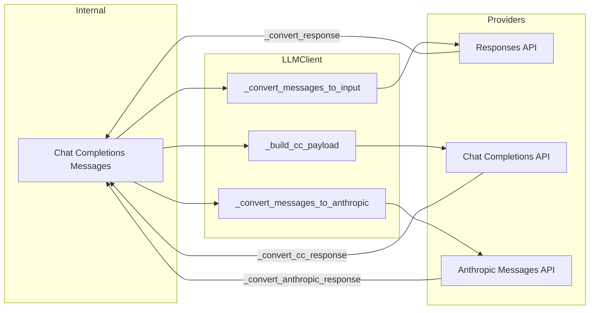

# LLM Client Deep Dive

`LLMClient` in `llm.py` (~1,400 lines) is the HTTP layer that talks to LLM providers. It supports three API formats, handles thinking/reasoning parameters, implements prompt caching for Anthropic, manages token usage tracking, and provides abort/cancellation for streaming.

## Three API Formats

Koi internally uses **OpenAI Chat Completions message format** everywhere (messages array with `role`, `content`, `tool_calls`, `tool_call_id`). `LLMClient` translates to/from each provider's format at the boundary.



### Responses API (OpenAI)

Converts messages to `input` items with `role`-based messages and `function_call`/`function_call_output` items:

```python
# System prompt → "developer" role in input
{"role": "developer", "content": system_prompt}

# Tool calls → function_call items
{"type": "function_call", "call_id": "...", "name": "...", "arguments": "..."}

# Tool results → function_call_output items
{"type": "function_call_output", "call_id": "...", "output": "..."}
```

Tools are flattened: `{type: function, function: {name, ...}}` → `{type: function, name, ...}`.

### Chat Completions API

Mostly passthrough — messages are already in the right format. The system prompt is prepended as `messages[0]` with `role: "system"`:

```python
def _build_cc_payload(self, messages, tools, stream, system_prompt):
    payload_messages = list(messages)
    if system_prompt:
        payload_messages.insert(0, {"role": "system", "content": system_prompt})
```

### Anthropic Messages API

Significant conversion required:

- **System prompt**: Passed as the top-level `system` field (not in messages)
- **Tool calls**: `tool_calls` array → `tool_use` content blocks within the assistant message
- **Tool results**: Consecutive tool results are grouped into a single `user` message with `tool_result` content blocks
- **Arguments**: JSON string → parsed dict (Anthropic expects `input` as object, not string)

```python
# Chat Completions tool call:
{"role": "assistant", "tool_calls": [{"id": "...", "function": {"name": "read_file", "arguments": '{"path": "foo"}'}}]}

# Becomes Anthropic:
{"role": "assistant", "content": [{"type": "tool_use", "id": "...", "name": "read_file", "input": {"path": "foo"}}]}
```

## Thinking / Reasoning

### Per-Provider Implementation

| Format | Parameter | Values |
|--------|-----------|--------|
| Anthropic | `thinking.type` + `thinking.budget_tokens` | enabled, 1024–16384 |
| Chat Completions | `reasoning_effort` | low, medium, high |
| Responses | `reasoning.effort` | low, medium, high |

### Anthropic Thinking Budget

```python
_ANTHROPIC_THINKING_BUDGETS = {
    "minimal": 1024,
    "low": 2048,
    "medium": 8192,
    "high": 16384,
}
```

When thinking is enabled for Anthropic, `max_tokens` is adjusted to accommodate both thinking and output:

```python
def _adjust_max_tokens_for_thinking(base_max, budget, model_max):
    max_tokens = min(base_max + budget, model_max)
    if max_tokens <= budget:
        budget = max(0, max_tokens - 1024)  # Reserve 1024 for output
    return max_tokens, budget
```

Anthropic also requires:
- `anthropic-beta: interleaved-thinking-2025-05-14` header
- Temperature must be **omitted** (not set to any value)

### Thinking Fallback

If the LLM API returns an error mentioning "thinking", "reasoning", or "budget_tokens", Koi automatically retries without thinking params:

```python
_THINKING_ERROR_PATTERNS = re.compile(
    r"thinking|reasoning|budget_tokens|not.?supported.*reason|...",
    re.IGNORECASE,
)
```

The `_thinking_disabled_fallback` flag prevents subsequent attempts.

### Reasoning Tags

For models that don't support native thinking but where the user wants reasoning, Koi uses prompt-based `<think>/<final>` tags. The `use_reasoning_tags` flag triggers this:

```python
def uses_reasoning_tags(model, api_format, thinking_level):
    if thinking_level == "off":
        return False
    if supports_thinking(model, api_format):
        return False
    return True  # Thinking requested but no native support
```

When enabled, the system prompt includes formatting instructions, and `strip_thinking_tags()` in `agent.py` processes the output.

## Prompt Caching (Anthropic)

`_apply_prompt_caching()` adds `cache_control` annotations for Anthropic's prompt caching feature:

```python
def _apply_prompt_caching(self, system_prompt, anthropic_msgs):
    if not self.config.prompt_caching:
        return system_prompt, anthropic_msgs

    # Cache the system prompt
    system_value = [{
        "type": "text",
        "text": system_prompt,
        "cache_control": {"type": "ephemeral"},
    }]

    # Cache the last user message with tool_result blocks
    for msg in reversed(anthropic_msgs):
        if msg.get("role") == "user":
            content = msg.get("content")
            if isinstance(content, list):
                if any(b.get("type") == "tool_result" for b in content):
                    content[-1]["cache_control"] = {"type": "ephemeral"}
                    break

    return system_value, anthropic_msgs
```

Two cache breakpoints:
1. **System prompt**: Always cached (stays constant across turns)
2. **Last tool result group**: The most recent `user` message containing tool results

## Token Usage Tracking

`LLMClient` maintains a `TokenUsage` instance that accumulates across all requests:

```python
self.usage = TokenUsage()
```

Usage is extracted per format:

| Format | Input field | Output field | Cache fields |
|--------|------------|--------------|-------------|
| Anthropic | `input_tokens` | `output_tokens` | `cache_read_input_tokens`, `cache_creation_input_tokens` |
| Chat Completions | `prompt_tokens` | `completion_tokens` | — |
| Responses | `input_tokens` | `output_tokens` | — |

For streaming without explicit usage reporting, Koi falls back to estimating output tokens from content length (`len(content) // 4`).

## Retry Logic

Non-streaming requests use `_post_with_retries()`:

```python
RETRYABLE_STATUS_CODES = {429, 500, 502, 503, 504}
MAX_RETRIES = 6
MAX_BACKOFF = 60
```

Retry behavior:
- **Exponential backoff**: `min(2^(attempt+1), 60)` seconds
- **Retry-After header**: Respected if present
- **Thinking errors**: Auto-retry without thinking params (no backoff)
- **Connection errors / timeouts**: Retried with backoff
- **Non-retryable HTTP errors**: Raised immediately

## Abort / Cancellation

```python
def abort_stream(self):
    resp = self._active_stream_response
    if resp is not None:
        resp.close()  # sync close — unblocks async iterator
        self._active_stream_response = None
```

Called from the SIGINT handler (sync context). The `_active_stream_response` is the `httpx.Response` object from `client.stream()`. Closing it synchronously unblocks the `aiter_lines()` loop.

## `stream_options` Detection

For Chat Completions, Koi tries to enable `stream_options: {include_usage: true}` for accurate token counting during streaming. If the provider rejects it (HTTP 400), Koi disables it for the session:

```python
self._stream_include_usage = True

# On 400 error:
self._stream_include_usage = False
payload.pop("stream_options", None)
# Retry without stream_options
```

## Model Support Detection

`supports_thinking()` determines if a model supports native thinking/reasoning:

| Model Pattern | Supports Thinking? |
|---------------|-------------------|
| `claude-4*`, `claude-opus-4*`, `claude-sonnet-4*` | Yes (Anthropic) |
| `claude-3.5-sonnet` | Yes (Anthropic) |
| `claude-3.5-haiku`, `claude-3-*` | No |
| `o1`, `o3`, `o4` | Yes (OpenAI) |
| `gpt-5*` | Yes |
| `qwen-3*` | Yes |
| `deepseek-r1`, `deepseek-reasoner` | No (always-on reasoning) |
| `gpt-4*` | No |
| Unknown | No (safe default) |

## Related Pages

- [Streaming Protocol](streaming.md) — How `stream_chat()` works
- [Configuration](config.md) — API format, thinking level, prompt caching settings
- [Architecture Overview](architecture.md) — How LLMClient fits in the stack
