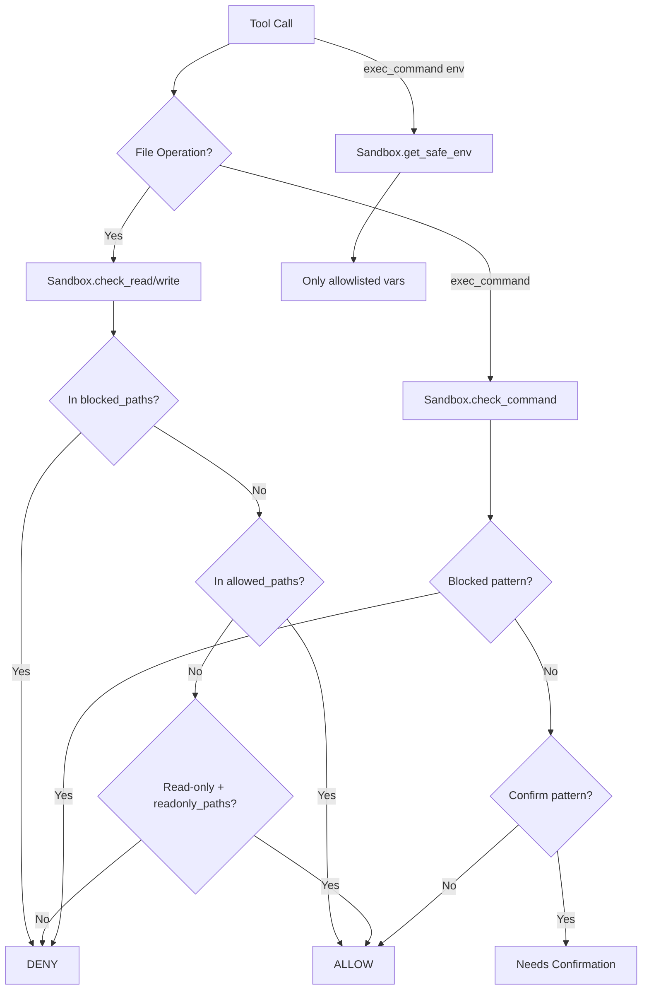

# Sandbox Security

Koi's sandbox restricts what the agent can access on the filesystem, which environment variables are visible, and which shell commands are allowed. Configuration is via `.koi/sandbox.yaml`.

## Overview



## Configuration File

Located at `.koi/sandbox.yaml`. If it doesn't exist, Koi uses permissive defaults.

```yaml
filesystem:
  allowed_paths:
    - "."                    # Project root (default)
    - "~/shared-libs"        # Absolute paths supported
  readonly_paths:
    - "/etc"
    - "~/.config"
  blocked_paths:
    - ".env"
    - "secrets/"
    - "~/.ssh"

environment:
  allowlist:
    - PATH
    - HOME
    - USER
    - SHELL
    - LANG
    - TERM
    - SSH_AUTH_SOCK
    - SSH_AGENT_PID

commands:
  blocked_patterns:
    - "rm\\s+-rf\\s+/"       # Block recursive delete from root
    - "curl.*\\|.*sh"        # Block pipe-to-shell
  confirm_patterns:
    - "git\\s+push"          # Require confirmation for push
    - "docker\\s+rm"         # Require confirmation for container removal
```

## File Access Control

### Path Resolution

All paths are resolved relative to the project root (`sandbox.py:41`):

```python
def _resolve(self, p: str) -> Path:
    expanded = Path(os.path.expanduser(p))
    if expanded.is_absolute():
        return expanded.resolve()
    return (self.project_root / expanded).resolve()
```

- `~` is expanded to the home directory
- Relative paths are resolved relative to `project_root` (defaults to `cwd`)
- All paths are `.resolve()`d to canonical form (no symlink tricks)

### Access Check Logic

`_check_file_access()` evaluates in this order:

1. **Blocked paths always win**: If the resolved path is under any `blocked_paths` entry → **DENY**
2. **Allowed paths**: If under any `allowed_paths` entry → **ALLOW** (read + write)
3. **Readonly paths** (read only): If reading and under any `readonly_paths` entry → **ALLOW**
4. **Default**: **DENY** with message showing which operation (read/write) was blocked

```python
def check_read(self, path: str) -> Tuple[bool, Optional[str]]:
    """Returns (allowed, reason)."""

def check_write(self, path: str) -> Tuple[bool, Optional[str]]:
    """Returns (allowed, reason)."""
```

### Default Paths

When no `sandbox.yaml` exists:

```python
allowed_paths = ["."]  # Current directory only
readonly_paths = []
blocked_paths = []
```

## Environment Scrubbing

`get_safe_env()` returns a copy of `os.environ` containing **only** allowlisted variables:

```python
def get_safe_env(self) -> Dict[str, str]:
    return {k: v for k, v in os.environ.items() if k in self.env_allowlist}
```

Default allowlist:
```
PATH, HOME, USER, SHELL, LANG, TERM, SSH_AUTH_SOCK, SSH_AGENT_PID
```

This is used by `exec_command` — the subprocess runs with a minimal environment. API keys, cloud credentials, and other sensitive env vars are stripped unless explicitly allowlisted.

## Command Filtering

`check_command()` evaluates shell commands against regex patterns:

```python
def check_command(self, command: str) -> Tuple[bool, Optional[str], bool]:
    """Returns (allowed, reason, needs_confirm)."""
```

1. **Blocked patterns**: If any `blocked_patterns` regex matches → `(False, reason, False)`
2. **Confirm patterns**: If any `confirm_patterns` regex matches → `(True, reason, True)`
3. **Default**: `(True, None, False)` — allowed without confirmation

All patterns are compiled with `re.IGNORECASE`.

When a command needs confirmation, the tool executor returns an error-like result with `needs_confirmation: True`, prompting the LLM to inform the user before proceeding.

## Integration Points

### ToolExecutor

Every file operation and command execution goes through the sandbox:

```python
# File read
allowed, reason = self.sandbox.check_read(path)

# File write
allowed, reason = self.sandbox.check_write(path)

# Command execution
allowed, reason, needs_confirm = self.sandbox.check_command(command)
env = self.sandbox.get_safe_env()
```

### `remove_file` Tool

The `remove_file` tool has an **additional** restriction beyond the sandbox — it only allows removal of paths under `.koi/`:

```python
try:
    target.relative_to(koi_dir)
except ValueError:
    return {"error": "Access denied: can only remove paths under .koi/"}
```

## Example Configurations

### Restrictive (production cron jobs)

```yaml
filesystem:
  allowed_paths:
    - "."
  readonly_paths:
    - "/etc/hosts"
  blocked_paths:
    - ".env"
    - ".git"
    - "node_modules"

environment:
  allowlist:
    - PATH
    - HOME

commands:
  blocked_patterns:
    - "rm\\s+-rf"
    - "curl.*\\|.*sh"
    - "wget.*\\|.*sh"
    - "sudo"
  confirm_patterns:
    - "git\\s+push"
    - "npm\\s+publish"
```

### Permissive (local development)

```yaml
filesystem:
  allowed_paths:
    - "."
    - "~"
  readonly_paths:
    - "/usr/local"

environment:
  allowlist:
    - PATH
    - HOME
    - USER
    - SHELL
    - LANG
    - TERM
    - EDITOR
    - VIRTUAL_ENV
```

## Related Pages

- [Tool System](tools.md) — How tools use the sandbox
- [Configuration](config.md) — Main config file
- [Cron Integration](cron.md) — Sandbox applies to cron tasks too
