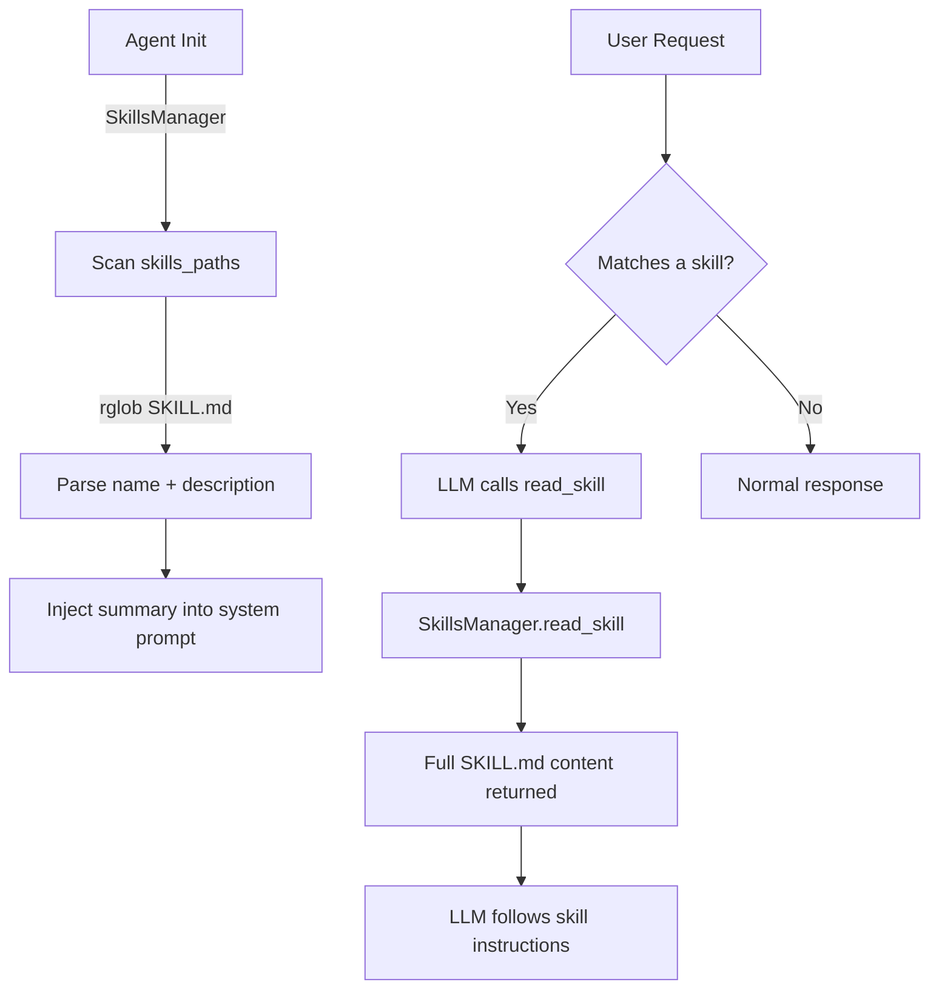

# Skills System

Koi's skills are markdown-based packages that extend the agent with specialized knowledge, workflows, and domain expertise. They're loaded into the system prompt at runtime and invoked via the `read_skill` tool.

## How Skills Work



## `SKILL.md` File Format

Each skill is a directory containing a `SKILL.md` file. The file is standard markdown with a name extracted from the first `# Heading`:

```markdown
# My Skill Name

A description paragraph that explains what this skill does.
This becomes the skill's description in the system prompt.

## Instructions

Detailed instructions the LLM follows when this skill is activated...
```

Parsing rules (`skills.py:69`):
1. **Name**: First `# Heading` in the file. Falls back to the parent directory name.
2. **Description**: First paragraph after the title heading. Truncated to 200 chars.
3. **Path**: Stored as `skill["path"]` for loading the full content later.

## `SkillsManager`

The `SkillsManager` class (`skills.py:8`) handles discovery and loading.

### Initialization

```python
class SkillsManager:
    def __init__(self, skills_paths: List[str]):
        self.skills_paths = [Path(p) for p in skills_paths]
```

The `skills_paths` come from config — by default `[".koi/skills"]`. Multiple paths are supported.

### Discovery — `list_skills()`

Recursively scans all skills paths for `SKILL.md` files:

```python
def list_skills(self):
    skills = []
    for skills_path in self.skills_paths:
        for skill_file in skills_path.rglob("SKILL.md"):
            skill_info = self._parse_skill_file(skill_file)
            if skill_info:
                skills.append(skill_info)
    return skills
```

Each skill is returned as:
```python
{"name": "Skill Name", "description": "...", "path": Path("...")}
```

### Loading — `read_skill(skill_name)`

Loads the full content of a skill by name:

```python
def read_skill(self, skill_name):
    skills = self.list_skills()
    query = skill_name.lower().strip()
    for skill in skills:
        dir_name = skill["path"].parent.name.lower()
        if skill["name"].lower() == query or dir_name == query:
            return open(skill["path"]).read()
    raise FileNotFoundError(f"Skill '{skill_name}' not found")
```

Matching is case-insensitive and works on either the parsed title or the parent directory name. This means a skill in `.koi/skills/my-tool/SKILL.md` with title "My Tool Guide" can be loaded as either "My Tool Guide" or "my-tool".

### Summary — `get_skills_summary()`

Generates a compact listing for the system prompt:

```
Available skills:
- Skill Creator: Guide for creating effective skills...
- Code Review: Automated code review workflow...
```

## System Prompt Integration

Skills are injected into the system prompt via `_build_skills_section()` in `prompts.py:143`:

```python
def _build_skills_section(config):
    skills_manager = SkillsManager(config.skills_paths)
    skills_summary = skills_manager.get_skills_summary()

    return f"""## Skills
{skills_summary}

Before responding: scan available skills above.
- If one clearly matches the user's request, use read_skill to load it, then follow its instructions.
- If none clearly match, do not read any skill.
- Never read more than one skill upfront; only read after selecting.
- Use read_skill (not read_file) to load skills."""
```

The instructions tell the LLM to:
1. Check the skills list before responding
2. Only load a skill if it clearly matches
3. Use `read_skill` (not `read_file`) to load skills
4. Never load more than one skill proactively

## The `read_skill` Tool

Defined in `tools.py` as a standard tool, executed by `ToolExecutor._read_skill()`:

```python
async def _read_skill(self, skill_name):
    content = self.skills_manager.read_skill(skill_name)
    return {"content": content, "skill_name": skill_name, "success": True}
```

The full SKILL.md content is returned to the LLM as a tool result, which the LLM then follows as instructions.

## Bundled Skills

Koi ships with one bundled skill:

### `skill-creator`

Located at `src/koi/bundled_skills/skill-creator/SKILL.md`. Provides guidance for creating new skills — it's a meta-skill that helps users extend Koi with their own domain-specific skills.

## Creating Custom Skills

1. Create a directory under `.koi/skills/`:
   ```
   .koi/skills/my-skill/
   └── SKILL.md
   ```

2. Write a `SKILL.md` with a title and description:
   ```markdown
   # My Custom Skill

   A brief description of what this skill does.

   ## Instructions

   Detailed instructions for the LLM...
   ```

3. The skill will be automatically discovered on the next agent initialization.

Skills can include subdirectories with reference files, scripts, or templates — only the `SKILL.md` file is parsed for metadata, but the LLM can use `read_file` to access supporting files.

## `/skills` Command

Users can list available skills interactively:

```
koi> /skills
Available Skills:
- Skill Creator: Guide for creating effective skills...
```

This calls `Agent._handle_command()` → `self.skills_manager.list_skills()`.

## Related Pages

- [Configuration](config.md) — `skills_paths` config field
- [Tool System](tools.md) — The `read_skill` tool
- [Architecture Overview](architecture.md) — System prompt construction
