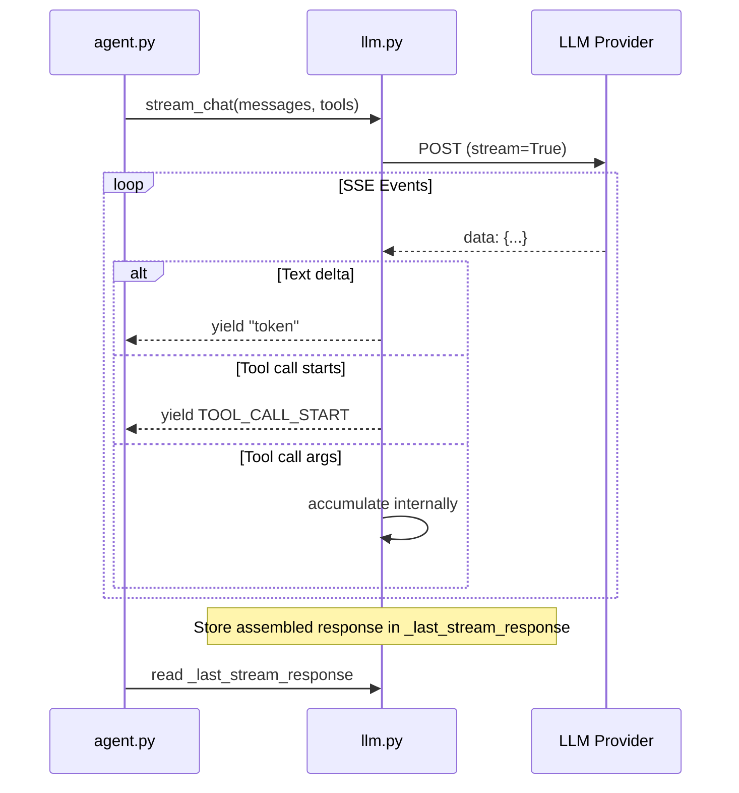
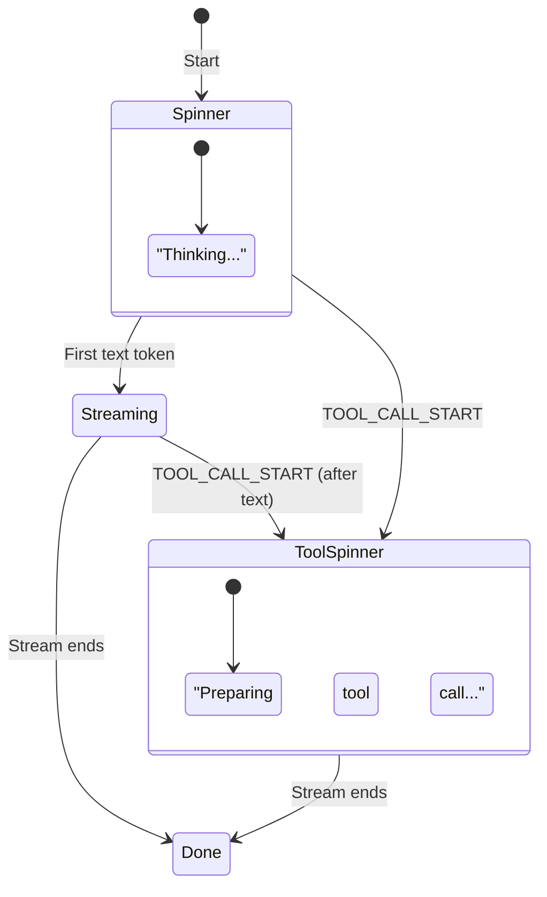

# Streaming Protocol

How token streaming works across Koi's three API formats, and how the agent loop consumes the stream for real-time display.

## Overview

Koi streams LLM responses token-by-token in interactive mode, providing immediate visual feedback as the model generates text. The streaming system handles three different API formats, each with its own SSE event protocol, and normalizes them into a single `AsyncGenerator[str, None]` interface.



## The `TOOL_CALL_START` Sentinel

Defined at the top of `llm.py`:

```python
TOOL_CALL_START = '\x00__TOOL_CALL__\x00'
```

This sentinel is yielded by `stream_chat()` the first time a new tool-call block appears in the stream. It allows the UI layer in `agent.py` to switch from "streaming text" mode to "preparing tool call" mode — typically showing a spinner.

The sentinel is **not** a text token — it uses null bytes so it can never appear in normal model output. The agent's `_stream_response()` method checks for it explicitly:

```python
async for token in self.llm_client.stream_chat(messages, tools=tools, ...):
    if token == TOOL_CALL_START:
        # Show spinner: "Preparing tool call..."
        continue
    # Otherwise: display the text token
    console.file.write(token)
```

## `stream_chat()` — The Unified Entry Point

`LLMClient.stream_chat()` (`llm.py:996`) is an `AsyncGenerator` that dispatches to the appropriate format-specific streaming method:

```python
async def stream_chat(self, messages, tools=None, system_prompt=None):
    if self.config.api_format == "anthropic":
        async for token in self._stream_anthropic_tokens(...):
            yield token
    elif self.config.api_format == "chat_completions":
        async for token in self._stream_chat_completions_tokens(...):
            yield token
    else:  # responses
        # Inline streaming logic for Responses API
        ...
```

All three paths:
1. **Yield text tokens** as they arrive
2. **Yield `TOOL_CALL_START`** when a new tool call begins
3. **Accumulate tool call arguments** internally (not yielded)
4. **Store the full assembled response** in `self._last_stream_response` when the stream ends

## Format-Specific Streaming

### Responses API (OpenAI)

SSE events processed:
| Event | Action |
|-------|--------|
| `response.output_text.delta` | Yield `delta` text |
| `response.output_item.added` (type=function_call) | Yield `TOOL_CALL_START`, start accumulating |
| `response.function_call_arguments.delta` | Accumulate args; yield `TOOL_CALL_START` on first chunk |
| `response.completed` | Parse final `response` object via `_convert_response()` |

If `response.completed` is received, it short-circuits and stores the converted response directly. Otherwise, the response is assembled from accumulated deltas.

### Chat Completions API

Uses `_stream_chat_completions_tokens()` (`llm.py:1137`). SSE events follow the standard OpenAI Chat Completions streaming format:

| Field in `choices[0].delta` | Action |
|----|--------|
| `content` | Yield text token |
| `tool_calls[].index` (new) | Yield `TOOL_CALL_START`, start accumulating |
| `tool_calls[].function.arguments` | Append to accumulated args |
| `usage` (final chunk) | Extract token usage |

Tool calls are keyed by `index` (integer), and the final response orders them by sorted index.

Koi tries to send `stream_options: {include_usage: true}` for token counting. If the provider rejects it (HTTP 400), Koi disables it for the session and retries without.

### Anthropic Messages API

Uses `_stream_anthropic_tokens()` (`llm.py:1230`). Anthropic uses a different SSE event structure:

| Event Type | Action |
|------------|--------|
| `message_start` | Extract initial usage |
| `content_block_start` (type=tool_use) | Yield `TOOL_CALL_START`, init tool call |
| `content_block_delta` (text_delta) | Yield text token |
| `content_block_delta` (input_json_delta) | Accumulate tool call args |
| `content_block_delta` (thinking_delta) | **Skip** (thinking blocks are stripped) |
| `message_delta` | Extract final usage |
| `message_stop` | Break |

Thinking deltas (`thinking_delta`) are explicitly skipped — they never reach the UI.

## `_stream_response()` — The Consumer in `agent.py`

`Agent._stream_response()` (`agent.py:474`) is the interactive-mode consumer. It manages the visual state machine:



The flow:

1. **Start**: Show a "Thinking..." spinner while waiting for the first token
2. **First text token**: Stop spinner, print blank line + indent, start streaming text
3. **`TOOL_CALL_START`**: If spinner is still active, update its label; if text was already streaming, restart a spinner with "Preparing tool call..."
4. **Text tokens**: Write directly to `console.file` (raw output, no Rich formatting)
5. **Stream ends**: Read `self.llm_client._last_stream_response` for the assembled response

For models using reasoning tags (`use_reasoning_tags=True`), text is collected but not displayed live. Instead, after the stream completes, `strip_thinking_tags()` extracts `<final>...</final>` content and renders it as Markdown.

## Abort / Cancellation

When the user presses Ctrl+C during streaming:

1. `Agent._handle_sigint()` sets `_interrupted = True` and calls `task.cancel()`
2. `LLMClient.abort_stream()` synchronously closes `_active_stream_response` (the httpx response object)
3. This unblocks the async iterator immediately
4. `_stream_response()` catches `CancelledError` in its finally block, ensuring the spinner is stopped

```python
def abort_stream(self):
    resp = self._active_stream_response
    if resp is not None:
        resp.close()  # sync close — unblocks the async iterator
        self._active_stream_response = None
```

## Non-Interactive Mode

In non-interactive mode (cron, pipe), streaming is not used. `_agent_loop()` calls `self.llm_client.chat()` directly, which makes a blocking HTTP request and returns the full response. The `_stream_response()` method is only invoked in interactive mode.

## Related Pages

- [LLM Client](llm-client.md) — Full details on `LLMClient` and the three API formats
- [Architecture Overview](architecture.md) — The agent loop and execution modes
