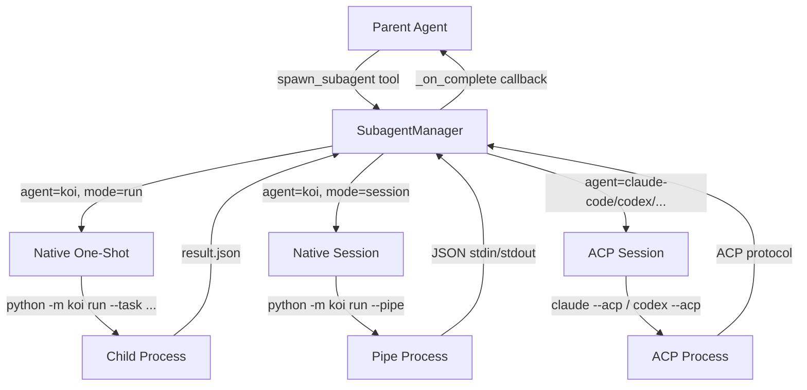
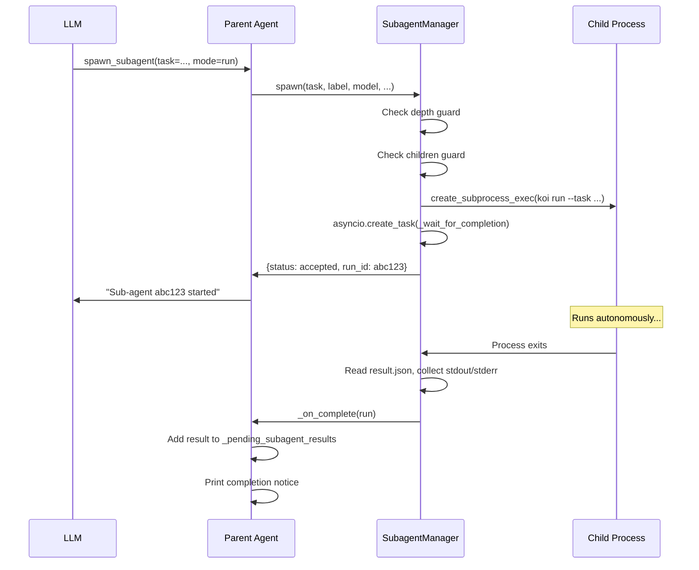
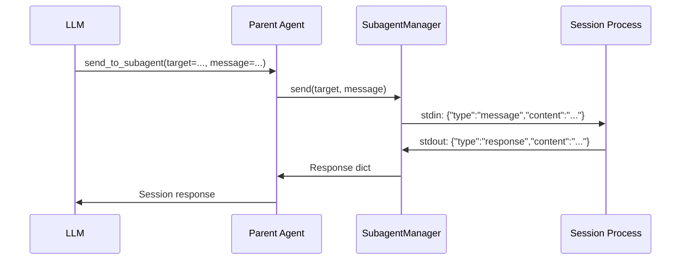

# Sub-Agent System

Koi can spawn isolated child agents that run in parallel. Sub-agents can be one-shot tasks or persistent sessions, and support both native Koi children and external ACP-compatible agents (Claude Code, Codex, Gemini, etc.).

## Architecture



## Sub-Agent Modes

### One-Shot (`mode=run`)

Spawns a child Koi process that executes a single task and exits:

```python
cmd = [sys.executable, "-m", "koi", "run",
       "--task", task, "--non-interactive",
       "--result-file", str(result_file)]
```

- Runs in the background (`asyncio.create_task`)
- Stdout/stderr captured
- Result written to `.koi/subagent-runs/<run_id>.json`
- Parent is notified via `_on_complete` callback when done

### Persistent Session (`mode=session`)

Spawns a child Koi process in **pipe mode** that stays alive for follow-up messages:

```python
cmd = [sys.executable, "-m", "koi", "run", "--pipe"]
```

Communication is JSON-over-stdin/stdout:

```
Parent → Child:  {"type": "message", "content": "do X"}
Child → Parent:  {"type": "response", "content": "Done.", "usage": {...}}
Parent → Child:  {"type": "shutdown"}
```

Sessions have an **idle timeout** (default 1800s / 30 minutes). An `_idle_watcher` coroutine checks every 60 seconds and kills idle sessions.

### ACP Session

Spawns an external ACP-compatible agent (Claude Code, Codex, Gemini, etc.):

```python
acp_sess = ACPSession(command=agent.command, cwd=cwd, auto_approve=True)
session_id = await acp_sess.start()
```

Communication uses the ACP protocol via `ACPSession.send()`.

## Depth and Children Guards

### Depth Guard

Prevents infinite recursion. Each child increments `KOI_SPAWN_DEPTH`:

```python
env = {**os.environ, "KOI_SPAWN_DEPTH": str(self._depth + 1)}
```

Default max depth: **3** (`max_depth=3`).

```
Depth 0: Parent agent
Depth 1: Child agent
Depth 2: Grandchild agent
Depth 3: Max — cannot spawn further
```

### Children Guard

Limits concurrent sub-agents per parent. Default: **5** (`max_children=5`).

```python
active_count = sum(1 for r in self.active_runs.values() if not r.completed)
if active_count >= self.max_children:
    return {"status": "error", "error": f"Max children reached ({self.max_children})"}
```

## `SubagentRun` Dataclass

Each sub-agent is tracked as a `SubagentRun` (`subagent.py:18`):

```python
@dataclass
class SubagentRun:
    id: str                          # 8-char UUID
    task: str                        # Task description
    label: Optional[str]             # Short display name
    process: asyncio.subprocess.Process
    result_file: Path                # .koi/subagent-runs/<id>.json
    started_at: datetime
    mode: str = "run"                # "run" or "session"
    timeout_seconds: int = 0         # 0 = no timeout
    completed: bool = False
    last_activity: Optional[datetime]  # For session idle tracking
    harness: str = "koi"             # "koi" (native) or "acp"
    agent_name: str = ""             # e.g. "claude-code"
    acp_session: Optional[Any] = None
    result: Optional[dict] = None
    exit_code: Optional[int] = None
    stdout: str = ""
    stderr: str = ""
    error: Optional[str] = None
```

## Lifecycle

### Spawn



### Session Communication



### Kill

Graceful shutdown attempts, then force kill:

```python
async def _kill_run(self, run, reason):
    if run.harness == "acp" and run.acp_session:
        await run.acp_session.close()
    elif run.mode == "session" and run.process.stdin:
        # Send shutdown message
        run.process.stdin.write(b'{"type":"shutdown"}\n')
        await asyncio.wait_for(run.process.wait(), timeout=2)

    # Force kill if still alive
    if run.process.returncode is None:
        run.process.kill()
```

## ACP Agent Registry

Koi includes a registry of known ACP-compatible agents (`acp_registry.py`):

| Name | Display Name | Binary | Command |
|------|-------------|--------|---------|
| `claude-code` | Claude Code | `claude` | `claude --acp` |
| `codex` | Codex CLI | `codex` | `codex --acp` |
| `gemini` | Gemini CLI | `gemini` | `gemini --acp` |
| `opencode` | OpenCode | `opencode` | `opencode --acp` |
| `goose` | Goose | `goose` | `goose --acp` |

Availability is checked via `shutil.which()`. The `list_available_agents` tool shows which agents are installed.

## Sub-Agent Tools

| Tool | Description |
|------|-------------|
| `spawn_subagent` | Spawn a sub-agent (run or session, native or ACP) |
| `send_to_subagent` | Send a follow-up message to a persistent session |
| `list_subagents` | List all tracked sub-agents with status |
| `kill_subagent` | Kill a running sub-agent |
| `list_available_agents` | List installed ACP agents |

## Pipe Mode (`agent.py`)

The child process runs `Agent.run_pipe_mode()` which:

1. Reads JSON lines from stdin via `asyncio.StreamReader`
2. Dispatches `{"type": "message"}` to the agent loop
3. Returns `{"type": "response"}` with the last assistant message
4. Shuts down on `{"type": "shutdown"}` or EOF

## Result Injection

Completed sub-agent results are injected into the parent's conversation at the start of each agent loop iteration:

```python
# In _agent_loop():
if self._pending_subagent_results:
    self.messages.extend(self._pending_subagent_results)
    self._pending_subagent_results.clear()
```

Results appear as system messages:
```python
{
    "role": "system",
    "content": "[Sub-agent 'label' (id=abc123) completed]\nExit code: 0\nResult: ..."
}
```

## Related Pages

- [Tool System](tools.md) — Sub-agent tools
- [Architecture Overview](architecture.md) — Pipe mode execution
- [Configuration](config.md) — `KOI_SPAWN_DEPTH` env var
