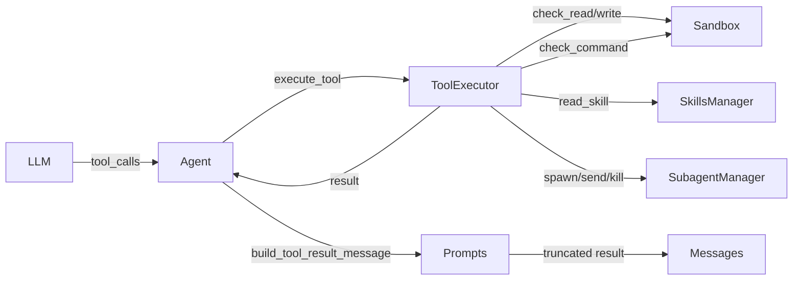

# Tool System

How tools are defined, registered, and executed in Koi. Includes all built-in tools, output truncation limits, and the sandbox integration.

## Architecture



## Tool Definitions — `get_tool_definitions()`

All tools are defined in `tools.py:25` as a list of OpenAI-format function definitions. This is the canonical tool schema that gets sent to the LLM with every request.

```python
def get_tool_definitions() -> List[Dict[str, Any]]:
    return [
        {
            "type": "function",
            "function": {
                "name": "read_file",
                "description": "Read the contents of a file...",
                "parameters": { ... }
            }
        },
        # ... 20 more tools
    ]
```

The definitions are format-agnostic — `LLMClient` converts them at call time:
- **Responses API**: Flattened via `_convert_tools()` — removes the outer `{type, function}` wrapper
- **Chat Completions**: Used as-is (already in CC format)
- **Anthropic**: Converted via `_convert_anthropic_tools()` — renames `parameters` to `input_schema`

## Built-in Tools

### File Operations

| Tool | Description | Key Params |
|------|-------------|------------|
| `read_file` | Read file contents. Defaults to first 2000 lines / 50KB. | `path`, `offset`, `limit` |
| `write_file` | Create or overwrite a file. Creates parent directories. | `path`, `content` |
| `edit_file` | Surgical find-and-replace edit. `old_text` must match exactly. | `path`, `old_text`, `new_text` |
| `remove_file` | Remove a file or directory. **Restricted to `.koi/` only.** | `path` |

### Search & Discovery

| Tool | Description | Key Params |
|------|-------------|------------|
| `glob_files` | Find files matching a glob pattern. Max 500 results. Skips `.git`, `node_modules`, `__pycache__`, etc. | `pattern`, `base_dir` |
| `grep_files` | Regex search across file contents. Returns up to 200 matches with file path and line number. | `pattern`, `path`, `file_glob`, `case_insensitive` |

### Execution

| Tool | Description | Key Params |
|------|-------------|------------|
| `exec_command` | Execute a shell command via `/bin/bash`. Uses sandboxed env vars. | `command`, `cwd`, `timeout` |

### Web

| Tool | Description | Key Params |
|------|-------------|------------|
| `web_fetch` | Fetch URL, parse HTML to text with BeautifulSoup. | `url` |
| `web_search` | Web search (stub — returns TODO, ready for provider integration). | `query` |

### Memory & Skills

| Tool | Description | Key Params |
|------|-------------|------------|
| `update_memory` | Append text to `.koi/MEMORY.md`. | `content` |
| `read_skill` | Read a skill's full content by name. | `skill_name` |

### Cron

| Tool | Description | Key Params |
|------|-------------|------------|
| `add_cron_job` | Schedule a natural-language task on a cron schedule. | `schedule`, `task` |
| `list_cron_jobs` | List all registered cron jobs. | — |
| `remove_cron_job` | Remove a cron job by ID. | `job_id` |

Note: Cron tools are **hidden** in non-interactive mode to prevent recursive scheduling.

### Alerts

| Tool | Description | Key Params |
|------|-------------|------------|
| `create_alert` | Create a structured alert file in `.koi/alerts/`. Sends a desktop notification. | `title`, `summary`, `severity`, `proposed_fix`, `fix_command` |
| `list_alerts` | List alerts filtered by status. | `status` (pending/approved/dismissed) |
| `resolve_alert` | Approve or dismiss an alert. Returns `fix_command` if approved. | `alert_file`, `resolution` |

### Sub-Agents

| Tool | Description | Key Params |
|------|-------------|------------|
| `spawn_subagent` | Spawn a sub-agent. `mode=run` for one-shot, `mode=session` for persistent. Supports ACP agents. | `task`, `label`, `mode`, `agent`, `model`, `thinking`, `timeout_seconds`, `cwd` |
| `list_subagents` | List all active and completed sub-agents. | — |
| `kill_subagent` | Kill a running sub-agent. | `run_id` |
| `send_to_subagent` | Send a message to a persistent session and get response. | `target`, `message` |
| `list_available_agents` | List ACP-compatible agents installed on this system. | — |

## `ToolExecutor`

`ToolExecutor` (`tools.py:358`) dispatches tool calls to the appropriate implementation method. It's initialized with three dependencies:

```python
class ToolExecutor:
    def __init__(self, skills_manager, sandbox, subagent_manager):
        self.skills_manager = skills_manager
        self.sandbox = sandbox or Sandbox()
        self.subagent_manager = subagent_manager
```

### Execution Flow

```python
async def execute_tool(self, tool_call):
    function_name = tool_call["function"]["name"].replace("-", "_")
    arguments = json.loads(tool_call["function"]["arguments"])

    if function_name == "read_file":
        return await self._read_file(**arguments)
    elif function_name == "write_file":
        return await self._write_file(**arguments)
    # ... dispatch table for all tools
```

Key behaviors:
- **Hyphen normalization**: `function_name.replace("-", "_")` handles models that return `read-file` instead of `read_file`
- **Argument parsing**: JSON-decodes the `arguments` string, returns an error result if parsing fails
- **Exception catching**: All tool methods are wrapped in a try/except that returns `{"error": ..., "success": False}`
- **CancelledError passthrough**: `asyncio.CancelledError` is re-raised so Ctrl+C works properly

### Sandbox Integration

File operations (`read_file`, `write_file`, `edit_file`) check access via the Sandbox before proceeding:

```python
async def _read_file(self, path, ...):
    allowed, reason = self.sandbox.check_read(path)
    if not allowed:
        return {"error": reason, "success": False}
    # ... proceed with reading
```

`exec_command` checks the command against sandbox patterns and uses `self.sandbox.get_safe_env()` for a sanitized environment.

## Output Truncation Limits

Koi enforces per-tool output limits at the tool execution layer (Layer 1 of the [4-layer context management system](context-management.md)):

```python
# tools.py constants
MAX_READ_LINES = 2000       # read_file: max lines
MAX_READ_BYTES = 50_000     # read_file: max 50KB
MAX_EXEC_OUTPUT_BYTES = 50_000  # exec_command: max 50KB combined stdout+stderr
MAX_WEB_FETCH_CHARS = 20_000   # web_fetch: max 20K chars
```

| Tool | Limit | Behavior |
|------|-------|----------|
| `read_file` | 2000 lines or 50KB | Appends `[output truncated: N of M lines shown]` |
| `exec_command` | 50KB combined | Truncates stdout first, then stderr. Adds `truncation_notice`. |
| `web_fetch` | 20K chars | Truncates with notice |
| `glob_files` | 500 matches | Sets `truncated: true` in result |
| `grep_files` | 200 matches | Sets `truncated: true` in result |

### Second Layer: `build_tool_result_message()`

After tool execution, the result passes through `prompts.py:build_tool_result_message()` which applies a second truncation based on the context window:

```python
def truncate_tool_result(text, context_window):
    max_chars = max(2000, min(int(context_window * 0.3 * 4), 400_000))
    if len(text) <= max_chars:
        return text
    # Truncate at newline boundary + add notice
```

Budget formula: `min(context_window * 1.2, 400K)` chars, floor of 2K.

## Tool Result Format

Tool methods return a dict with at least `success: bool`. Common patterns:

```python
# Success with content
{"content": "file contents...", "success": True}

# Success with message
{"message": "Successfully wrote 500 characters to foo.py", "success": True}

# Success with stdout/stderr
{"stdout": "...", "stderr": "...", "exit_code": 0, "success": True}

# Failure
{"error": "File not found: bar.py", "success": False}
```

`_format_tool_result()` in `prompts.py` normalizes these into a single string for the message array.

## Skipped Directories

`glob_files` and `grep_files` skip these directories:

```python
_SKIP_DIRS = frozenset({
    ".git", "node_modules", "__pycache__", ".venv", "venv",
    ".tox", "dist", "build", ".mypy_cache", ".pytest_cache",
})
```

## Related Pages

- [Sandbox Security](sandbox.md) — File access control, env scrubbing, command filtering
- [Context Management](context-management.md) — How tool output is managed across the 4-layer system
- [Sub-Agents](subagents.md) — Sub-agent spawning tools in detail
- [Skills System](skills.md) — The `read_skill` tool
